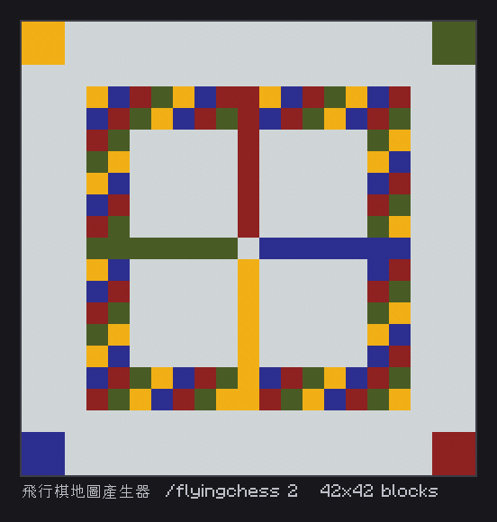

# 飛行棋地圖產生器

[English](README.md) | **繁體中文**

在你腳下用彩色混凝土鋪出 21 × 21 格的中式飛行棋棋盤：四角機場、兩格寬的四色跑道、四條回家通道與中央終點。

> 本儲存庫包含同一個腳本的兩個版本：**繁體中文（zh-TW）** 是作者伺服器實際使用的原始版本；**English** 為完整英文翻譯版（指令、訊息與變數名稱皆為英文），功能相同。

<!-- BEGIN LIVE SCREENSHOTS -->

## 畫面預覽

*在實機 Paper 26.2 伺服器執行 `/flyingchess 2`，依伺服器回傳的 1764 個方塊繪製的 42 x 42 棋盤俯視圖。*

> 這些是實機擷取後重繪的畫面，不是原生客戶端截圖。流程為：無頭客戶端登入實機 Paper 26.2 伺服器觸發腳本，再以官方 Minecraft 26.2 客戶端素材忠實重繪伺服器回傳的方塊／介面資料。Mojang/Microsoft 的圖像資產不屬於本專案程式碼授權範圍。

<!-- END LIVE SCREENSHOTS -->

## 功能特色

- 每格大小 1～8 可調（預設 2，棋盤為 42 × 42 方塊）
- 每鋪完一列等待一刻，避免瞬間卡頓
- 只放置方塊，不更動遊戲機制

## 需求

- [Paper](https://papermc.io/) 伺服器（開發環境 Paper 26.2 / Minecraft 26.2）
- [Skript](https://github.com/SkriptLang/Skript)（開發環境 2.16.2）

## 安裝

1. 先安裝[需求](#需求)中列出的插件。
2. 下載**其中一個**版本：

   | 版本 | 檔案 |
   |---|---|
   | 繁體中文（原始版本） | [`zh-TW/飛行棋地圖產生器.sk`](zh-TW/%E9%A3%9B%E8%A1%8C%E6%A3%8B%E5%9C%B0%E5%9C%96%E7%94%A2%E7%94%9F%E5%99%A8.sk) |
   | English（英文） | [`en/flying-chess-map-generator.sk`](en/flying-chess-map-generator.sk) |

3. 把 `.sk` 檔案放進伺服器的 `plugins/Skript/scripts/`。
4. 執行 `/sk reload 飛行棋地圖產生器`（請換成你放入的檔名），或重新啟動伺服器。

> [!IMPORTANT]
> **只能安裝其中一個版本。** 兩個版本是同一個腳本的不同語言，同時載入會互相衝突或重複執行。

## 指令

| 指令（中文版） | 英文版 | 說明 | 權限 |
|---|---|---|---|
| `/flyingchess [每格大小]` | `/flyingchess [size]` | 以你的位置為西北角，鋪在腳下那一層 | 所有人（限玩家執行） |

## 設定

- 顏色與版面定義在 `fcBlock()` 函式中。

## 注意事項

- 指令沒有設定權限；若不希望一般玩家一次放置最多約 28,000 個方塊（每格大小 8），請自行加上權限。

## 相關專案

- [skript-monopoly-map-generator](https://github.com/Im-Tim-mI/skript-monopoly-map-generator)－大富翁地圖產生器

## 授權

**MIT + Commons Clause**，完整條款請見 [LICENSE](LICENSE)。

- ✅ 可自由使用、複製、修改與分享本腳本。
- ✅ 本授權明確允許在收費或營利的 Minecraft 伺服器上安裝與運行本插件（含修改版）。
- ❌ 禁止的僅限於直接或間接販售本插件本體、修改版本，或以付費方式取得其檔案或原始碼。

Copyright (c) 2026 廷廷小教室、廷廷的家（Tim945）
